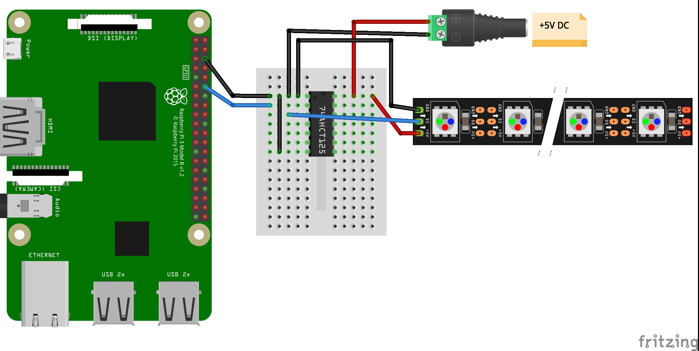
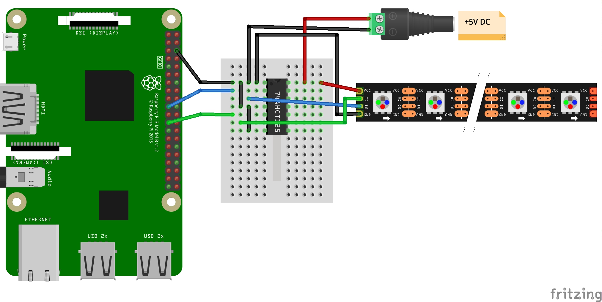
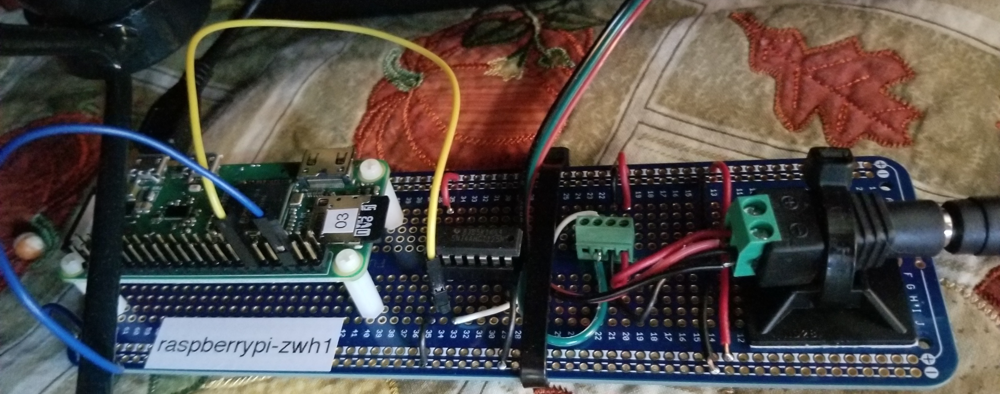
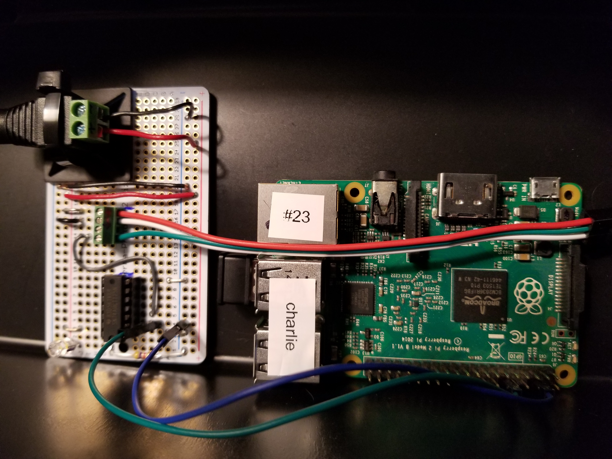

# Raspberry Pi Hardware Implementations
## Designs
The following Fritzing diagrams show designs for different LED types:

* WS281X 1-Wire PWM ([Adafruit Neopixel](https://learn.adafruit.com/adafruit-neopixel-uberguide))
* APA102 2-wire SPI ([Adafruit Dotstar](https://learn.adafruit.com/adafruit-dotstar-leds))

All of these designs show a +5V DC power supply for the LEDs. This power supply must be of ample capacity for the number of LEDs to be driven. While the power consumption of an LED can vary based on its type, typically allowing 40ma to 50ma per LED will cover most situations. If you run LEDs at less than 100% brightness and you do not run all LEDs all the time, you can get by with less than maximum current consumption (on a per LED basis). For example, I can run 50 WS2811 LEDs with a 2A power supply and the power supply will be barely warm. For a 200 LED string I use an 8A power supply. Typically, I run these LEDs at 25% brightness.
 
### WS2811 1-Wire PWM

### APA102 2-Wire SPI

## Example Implementations
The following sections show images for actual LED controller builds. While the physical form factor of each of these builds is different, design-wise they are the same. Each features

* a Raspberry Pi
* a level shifter
* a 5V power supply for feeding the LEDs
* a connector going from the controller to the LEDs

### Raspberry Pi ZW for WS281X

This implementation features an RPi ZW driving WS281X based LEDs using 1-wire PWM. GPIO 18 (pin 12) is the PWM output which goes to the [74AHCT125](https://www.adafruit.com/product/1787) level shifter. Note that the 74AHCT125 is not technically a level shifter. Rather, it is a buffer that can be used as an inexpensive level shifter (3.3v to 5v).

### Raspberry Pi v2B for WS281X
This implementation is the same as the RPi ZW based implementation except that an RPi v2B is used.

